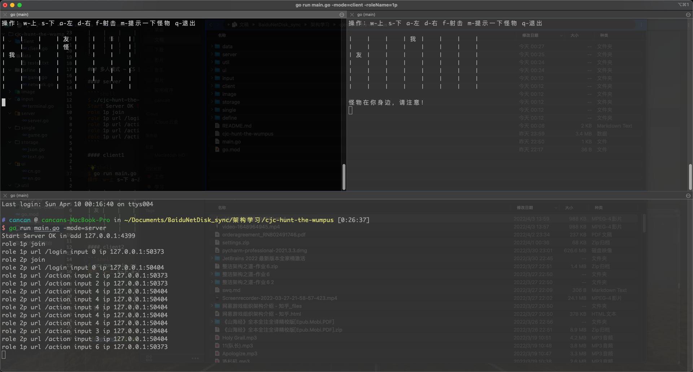

## Hunt the Wumpus

> 构建了 go-hunt-the-wumpus 执行文件，以下命令中的 go run main.go 可以用 ./go-hunt-the-wumpus 替代

### 运行参数

- roleName 进入游戏的角色名
- mode 运行模式，single 单机模式，server 服务端，client 客户端
- serverAddr 服务地址
- language 语言，默认中文
- storageType 存储类型，默认保存文本
- inputType 输入类型，默认终端输入
- mapLength 地图长度，默认 7
- mapWidth 地图宽度，默认 7

### 单机模式

```shell
$ go run main.go -mode=single
操作：w-上 s-下 a-左 d-右 f-射击 m-提示一下怪物 q-退出

|    |    |    |    |    |    |    |
| 我 |    |    |    |    |    |    |
|    |    |    |    |    |    |    |
|    |    |    |    |    |    |    |
|    | 怪 |    |    |    |    |    |
|    |    |    |    |    |    |    |
|    |    |    |    |    |    |    |
```

### 多人模式 - CS 架构

#### server

````shell
$ go run main.go -mode=server
Start Server OK in add 127.0.0.1:4399
role 1p join
role 1p url /login input 0 ip 127.0.0.1:50373
role 2p join
role 2p url /login input 0 ip 127.0.0.1:50404
role 1p url /action input 2 ip 127.0.0.1:50373
role 1p url /action input 2 ip 127.0.0.1:50373
role 1p url /action input 6 ip 127.0.0.1:50373
````

#### client1

```shell
$ go run main.go -mode=client -roleName=1p
操作：w-上 s-下 a-左 d-右 f-射击 m-提示一下怪物 q-退出

|    |    |    | 友 |    |    |    |
|    |    |    | 怪 |    |    |    |
| 我 |    |    |    |    |    |    |
|    |    |    |    |    |    |    |
|    |    |    |    |    |    |    |
|    |    |    |    |    |    |    |
|    |    |    |    |    |    |    |
```

#### client2

```shell
$ go run main.go -mode=client -roleName=2p
操作：w-上 s-下 a-左 d-右 f-射击 m-提示一下怪物 q-退出

|    |    |    | 我 |    |    |    |
|    |    |    |    |    |    |    |
| 友 |    |    |    |    |    |    |
|    |    |    |    |    |    |    |
|    |    |    |    |    |    |    |
|    |    |    |    |    |    |    |
|    |    |    |    |    |    |    |

怪物在你身边，请注意！
```

